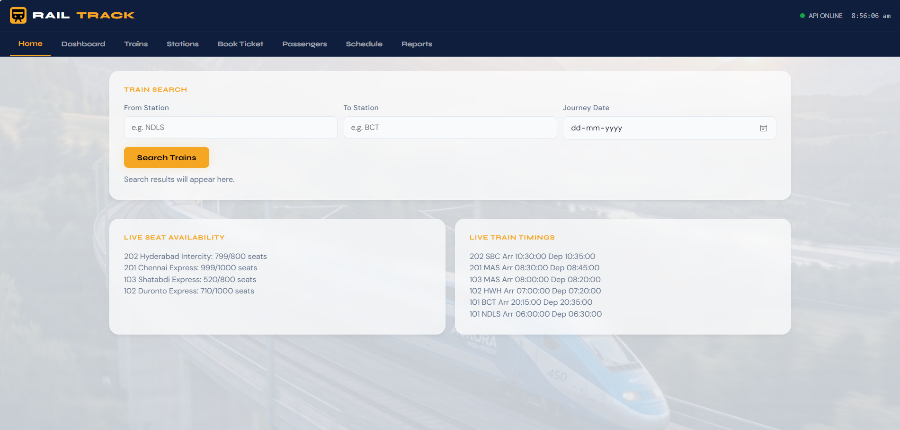
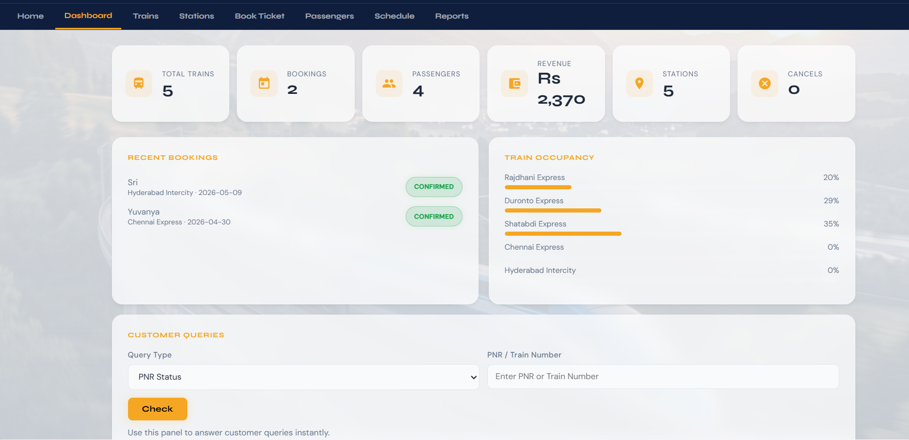
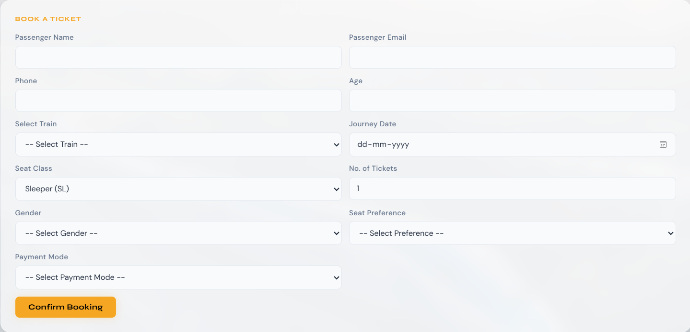

# Railway System Database (GitHub-style Multi-Page Project)

This project is now arranged in separate folders:

- `frontend/` for HTML/CSS/JS files
- `backend/` for Node/Express server, APIs, and data files

## Tech Stack

- Node.js + Express
- HTML/CSS/JavaScript
- JSON storage via `backend/data/db.json` (easy demo mode)
- MySQL schema files for DBMS design submission

## Features

- Train schedule and train records
- Booking, cancellation, and PNR generation
- Seat availability updates
- Passenger details and history
- Station and route schedule management
- Reports: revenue, occupancy, confirmed/cancelled bookings
- Class-wise fare management: `SL`, `3A`, `2A`, `1A`, `GN`

## Run

1. Go to backend folder:
   - `cd backend`
2. Install packages:
   - `npm install`
3. Start server:
   - `npm start`
4. Open:
   - `http://localhost:3000/login.html`

## Website images

## **Homepage**

## **Dashboard**

## **Bookingpage**

